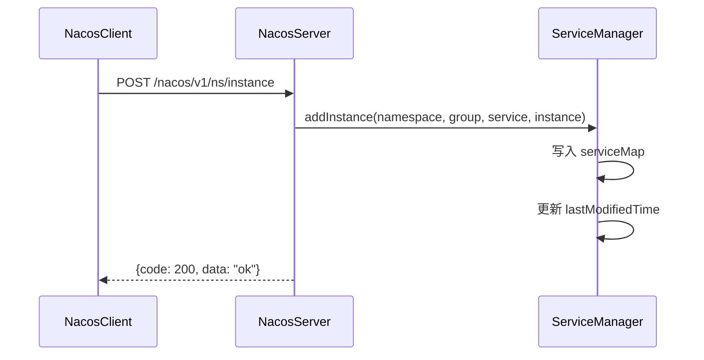
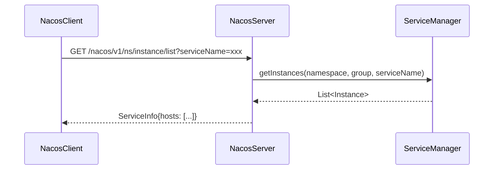

# 手写 Nacos 完全指南

> 基于"程序 = 数据结构 + 算法"方法论
> 目标：理解服务注册发现本质，实现核心功能

---

## 第一部分：架构全景与路线图

### 1.1 架构全景图

```
┌─────────────────────────────────────────────────────────────────┐
│                         接入层                                   │
│  ┌──────────────┐  ┌──────────────┐  ┌──────────────┐           │
│  │  HTTP 接入    │  │  gRPC 接入    │  │  推送接口     │  ★必须  │
│  └──────────────┘  └──────────────┘  └──────────────┘           │
└─────────────────────────────────────────────────────────────────┘
                              ↓
┌─────────────────────────────────────────────────────────────────┐
│                        核心服务层                                │
│  ┌──────────────────────────────────────────────────────┐      │
│  │                   注册发现模块 (Naming)                 │      │
│  │  ┌────────────┐ ┌────────────┐ ┌────────────┐       │      │
│  │  │ 服务注册    │ │ 服务发现    │ │ 健康检查    │  ★必须   │      │
│  │  └────────────┘ └────────────┘ └────────────┘       │      │
│  │  ┌────────────┐ ┌────────────┐ ┌────────────┐       │      │
│  │  │ 心跳管理    │ │ 服务订阅    │ │ 变更推送    │  ★必须   │      │
│  │  └────────────┘ └────────────┘ └────────────┘       │      │
│  └──────────────────────────────────────────────────────┘      │
│  ┌──────────────────────────────────────────────────────┐      │
│  │                   配置中心模块 (Config)                 │  ○可选 │
│  │  ┌────────────┐ ┌────────────┐ ┌────────────┐       │      │
│  │  │ 配置发布    │ │ 配置监听    │ │ 灰度发布    │       │      │
│  │  └────────────┘ └────────────┘ └────────────┘       │      │
│  └──────────────────────────────────────────────────────┘      │
└─────────────────────────────────────────────────────────────────┘
                              ↓
┌─────────────────────────────────────────────────────────────────┐
│                        存储与一致性层                            │
│  ┌──────────────────────────────────────────────────────┐      │
│  │                  单机存储引擎                          │  ★必须 │
│  │         (ServiceManager + ConcurrentHashMap)         │      │
│  └──────────────────────────────────────────────────────┘      │
│  ┌──────────────────────────────────────────────────────┐      │
│  │                  集群一致性协议                        │  ★必须 │
│  │  ┌────────────┐              ┌────────────┐         │      │
│  │  │ Distro协议  │  临时实例      │   JRaft    │ 持久/配置 │      │
│  │  └────────────┘              └────────────┘         │      │
│  └──────────────────────────────────────────────────────┘      │
└─────────────────────────────────────────────────────────────────┘
                              ↓
┌─────────────────────────────────────────────────────────────────┐
│                        基础设施层                                │
│  ┌──────────────┐  ┌──────────────┐  ┌──────────────┐           │
│  │  连接管理     │  │  任务调度     │  │  事件总线     │  ★必须  │
│  └──────────────┘  └──────────────┘  └──────────────┘           │
└─────────────────────────────────────────────────────────────────┘
```

### 1.2 核心模块取舍

**必须实现的 8 个核心模块：**

| 模块 | 核心问题 | 手写产出物 |
|------|---------|-----------|
| **1. 通信框架** | 客户端怎么和服务端通信？ | 基于 gRPC/HTTP 的极简 RPC 框架 |
| **2. 服务注册表** | 服务存在哪？怎么组织？ | `ServiceManager` 数据结构 |
| **3. 服务实例模型** | 实例有哪些属性？ | `Instance` 类设计 |
| **4. 健康检查** | 怎么知道服务还活着？ | 心跳检测 + 过期清理机制 |
| **5. 服务发现** | 客户端怎么拿到服务列表？ | 订阅 + 推送 + 本地缓存 |
| **6. 连接管理** | 如何管理海量长连接？ | `ConnectionManager` |
| **7. 集群同步** | 多节点数据怎么一致？ | Distro 协议简化版 |
| **8. 故障转移** | 服务端挂了怎么办？ | 客户端本地缓存 + 自动切换 |

**可以舍弃的 4 个模块：**

| 模块 | 舍弃理由 |
|------|---------|
| **控制台 UI** | 用 Postman/命令行替代，节省 80% 工作量 |
| **权限认证** | 理解机制即可，手写第一版不需要 |
| **多语言 SDK** | 先写 Java 版，其他语言原理相同 |
| **JRaft 完整实现** | 直接用开源实现，理解接入方式即可 |

---

## 第二部分：学习路径总览

```
┌─────────────────────────────────────────────────────────────────────────────┐
│  阶段0：前置知识（3天）                                                        │
│  ├── 0.1 gRPC 双向流通信原理                                                   │
│  ├── 0.2 CopyOnWrite 思想与应用                                               │
│  └── 0.3 一致性哈希算法                                                       │
└─────────────────────────────────────────────────────────────────────────────┘
                                      ↓
┌─────────────────────────────────────────────────────────────────────────────┐
│  阶段1：单机 MVP（7天）                                                        │
│  ├── 1.1 服务端存储结构设计（ServiceManager）                                  │
│  ├── 1.2 客户端配置体系（NacosClientProperties）                              │
│  ├── 1.3 服务注册流程实现                                                      │
│  ├── 1.4 服务发现流程实现                                                      │
│  └── 1.5 简单心跳机制                                                         │
└─────────────────────────────────────────────────────────────────────────────┘
                                      ↓
┌─────────────────────────────────────────────────────────────────────────────┐
│  阶段2：生产特性（10天）                                                       │
│  ├── 2.1 健康检查机制详解（临时 vs 持久实例）                                   │
│  ├── 2.2 连接管理器（ConnectionManager）                                       │
│  ├── 2.3 服务订阅与推送机制                                                    │
│  ├── 2.4 客户端本地缓存（ServiceInfoHolder）                                   │
│  ├── 2.5 故障转移（FailoverReactor）                                          │
│  └── 2.6 请求处理器体系（RequestHandler）                                      │
└─────────────────────────────────────────────────────────────────────────────┘
                                      ↓
┌─────────────────────────────────────────────────────────────────────────────┐
│  阶段3：集群一致性（10天）                                                     │
│  ├── 3.1 集群架构设计（Member、ServerMemberManager）                           │
│  ├── 3.2 Distro 协议原理与实现                                                 │
│  ├── 3.3 数据分片与负载均衡                                                    │
│  ├── 3.4 节点发现与加入机制                                                    │
│  └── 3.5 数据同步与一致性保证                                                  │
└─────────────────────────────────────────────────────────────────────────────┘
                                      ↓
┌─────────────────────────────────────────────────────────────────────────────┐
│  阶段4：高级特性（可选，7天）                                                   │
│  ├── 4.1 配置中心实现                                                         │
│  ├── 4.2 持久化实例管理                                                       │
│  └── 4.3 JRaft 集成                                                          │
└─────────────────────────────────────────────────────────────────────────────┘
```

**预计总学习时长：30天（阶段0-3）+ 7天（阶段4可选）**

---

## 第三部分：详细学习内容

---

## 阶段0：前置知识（3天）

### 0.1 gRPC 双向流通信原理

**学习目标**：理解 Nacos 2.x 为何选择 gRPC 作为通信框架

**数据结构**：
```java
// gRPC 核心数据结构
class GrpcConnection {
    String connectionId;           // 连接唯一标识
    Channel channel;               // gRPC 通道
    StreamObserver<Payload> streamObserver;
    long createTime;
    long lastActiveTime;
}
```

**关键算法**：
- 双向流建立流程
- 心跳保活机制
- 连接池管理

**实践任务**：
- [ ] 手写简化版 gRPC 双向流 demo
- [ ] 实现客户端心跳发送和服务端心跳检测

---

### 0.2 CopyOnWrite 思想与应用

**学习目标**：理解为何服务列表使用 CopyOnWrite 策略

**核心问题**：
- 服务列表读多写少，如何优化？
- 读写冲突如何解决？

**对比分析**：
| 策略 | 读性能 | 写性能 | 一致性 | 适用场景 |
|------|--------|--------|--------|----------|
| 读写锁 | 中 | 中 | 强 | 读写均衡 |
| CopyOnWrite | 高 | 低 | 最终 | 读多写少 |
| ConcurrentHashMap | 高 | 高 | 强 | 通用 |

**实践任务**：
- [ ] 手写 CopyOnWriteArrayList 简化版
- [ ] 性能对比测试（读99%写1%场景）

---

### 0.3 一致性哈希算法

**学习目标**：理解 Distro 协议的负载均衡基础

**数据结构**：
```java
class ConsistentHashRing {
    TreeMap<Long, Node> ring;      // 哈希环
    int virtualNodeCount;          // 虚拟节点数
    
    void addNode(Node node);       // 添加节点
    Node getNode(String key);      // 获取数据归属节点
}
```

**实践任务**：
- [ ] 手写一致性哈希实现
- [ ] 模拟节点上下线，观察数据迁移量

---

## 阶段1：单机 MVP（7天）

### 1.1 服务端存储结构设计

**问题驱动**：
```
问题：服务实例存在哪？怎么组织？
  ↓
需要：按命名空间隔离、按分组管理、按服务名索引
  ↓
数据结构：三层 Map 结构
```

**核心数据结构**：
```java
// ServiceManager.java
public class ServiceManager {
    /**
     * 三层索引结构：
     * namespace -> group -> serviceName -> Service
     * 
     * 示例：
     * "public" -> "DEFAULT_GROUP" -> "order-service" -> Service
     */
    private final Map<String, Map<String, Map<String, Service>>> 
        serviceMap = new ConcurrentHashMap<>();
}

// Service.java
public class Service {
    private String name;                           // 服务名
    private List<Instance> instances;              // 临时实例列表
    private Set<String> subscriberConnections;     // 订阅者连接ID集合
    private long lastModifiedTime;                 // 最后修改时间
}

// Instance.java
public class Instance {
    private String instanceId;      // 实例ID
    private String ip;              // IP地址
    private int port;               // 端口
    private double weight;          // 权重
    private boolean healthy;        // 健康状态
    private boolean ephemeral;      // 是否临时实例
    private Map<String, String> metadata;  // 元数据
    private long lastBeatTime;      // 最后心跳时间
}
```

**数据结构六要素分析**：

| 字段 | 类型 | 含义 | 创建位置 | 生命周期 |
|------|------|------|----------|----------|
| serviceMap | ConcurrentHashMap | 全局服务表 | ServiceManager构造 | 服务端启动创建，关闭销毁 |
| instances | CopyOnWriteArrayList | 服务实例列表 | Service初始化 | 服务注册时添加，注销时移除 |
| subscriberConnections | ConcurrentHashSet | 订阅者集合 | Service初始化 | 订阅时添加，取消订阅时移除 |
| lastModifiedTime | long | 用于推送比对 | 变更时更新 | 每次变更更新 |

**设计决策**：
```markdown
Q: 为什么用三层 Map 而不是单层？
A: 支持命名空间隔离和多环境部署

Q: 为什么 instances 用 CopyOnWriteArrayList？
A: 服务发现读多写少，CopyOnWrite 读性能高（无锁）

Q: 为什么需要 subscriberConnections？
A: 服务变更时需要推送通知给所有订阅者
```

---

### 1.2 客户端配置体系

**数据结构**：
```java
// NacosClientProperties.java
public class NacosClientProperties {
    /**
     * 配置源列表（按优先级排序）
     * 1. 配置文件 2. JVM 参数 3. 环境变量
     */
    private List<PropertySource> propertySources;
    
    public String getProperty(String key) {
        // 按优先级遍历所有配置源
        for (PropertySource source : propertySources) {
            String value = source.getProperty(key);
            if (value != null) return value;
        }
        return null;
    }
}
```

---

### 1.3 服务注册流程实现

**流程图**：


**核心代码**：
```java
// InstanceRequestHandler.java
public class InstanceRequestHandler extends RequestHandler {
    @Override
    public Response handle(Request request) {
        InstanceRequest req = (InstanceRequest) request;
        
        // 1. 提取参数
        String namespaceId = req.getNamespaceId();
        String groupName = req.getGroupName();
        String serviceName = req.getServiceName();
        Instance instance = req.getInstance();
        
        // 2. 添加到服务管理器
        serviceManager.addInstance(namespaceId, groupName, 
                                   serviceName, instance);
        
        // 3. 返回响应
        return new InstanceResponse("ok");
    }
}
```

---

### 1.4 服务发现流程实现

**流程图**：


---

### 1.5 简单心跳机制

**核心代码**：
```java
// ClientBeatProcessor.java
public class ClientBeatProcessor implements Runnable {
    @Override
    public void run() {
        // 1. 找到对应实例
        Instance instance = serviceManager.findInstance(
            namespaceId, groupName, serviceName, ip, port);
        
        // 2. 更新最后心跳时间
        instance.setLastBeatTime(System.currentTimeMillis());
        
        // 3. 如果之前不健康，恢复为健康
        if (!instance.isHealthy()) {
            instance.setHealthy(true);
        }
    }
}

// HealthCheckProcessor.java
public class HealthCheckProcessor implements Runnable {
    @Override
    public void run() {
        for (Service service : serviceManager.getAllServices()) {
            for (Instance instance : service.getInstances()) {
                long diff = System.currentTimeMillis() - instance.getLastBeatTime();
                
                if (diff > 15000) {
                    instance.setHealthy(false);  // 超过15秒，标记不健康
                }
                
                if (diff > 30000) {
                    service.removeInstance(instance);  // 超过30秒，剔除
                }
            }
        }
    }
}
```

---

## 阶段2：生产特性（10天）

### 2.1 健康检查机制详解

**临时实例 vs 持久实例对比**：

| 特性 | 临时实例 | 持久实例 |
|------|----------|----------|
| **心跳方式** | 客户端主动上报 | 服务端主动探测 |
| **存储位置** | 内存 | 内存 + 持久化存储 |
| **故障剔除** | 无心跳自动剔除 | 探测失败标记不健康 |
| **适用场景** | 无状态服务 | 有状态服务、网关 |

---

### 2.2 连接管理器

**数据结构**：
```java
// ConnectionManager.java
public class ConnectionManager {
    // 连接表：connectionId -> Connection
    private final ConcurrentHashMap<String, Connection> connections 
        = new ConcurrentHashMap<>();
    
    // 连接活跃时间：connectionId -> lastActiveTime
    private final ConcurrentHashMap<String, Long> activeTime 
        = new ConcurrentHashMap<>();
    
    // 待剔除连接集合
    private final Set<String> outDatedConnections = new HashSet<>();
    
    public void checkHealth() {
        long currentTime = System.currentTimeMillis();
        
        for (Map.Entry<String, Long> entry : activeTime.entrySet()) {
            String connectionId = entry.getKey();
            long lastActive = entry.getValue();
            
            // 超过20秒无活动，加入待剔除列表
            if (currentTime - lastActive > 20000) {
                outDatedConnections.add(connectionId);
            }
        }
        
        // 实际剔除
        for (String connectionId : outDatedConnections) {
            unregister(connectionId);
        }
    }
}
```

---

### 2.3 服务订阅与推送机制

**推模式 vs 拉模式对比**：

| 维度 | 推模式 | 拉模式 |
|------|--------|--------|
| **实时性** | 高（毫秒级） | 低（秒级） |
| **服务端压力** | 大（维护推送连接） | 小 |
| **客户端复杂度** | 低（被动接收） | 高（主动轮询） |
| **适用场景** | 实时性要求高的场景 | 大规模服务列表 |

**数据结构**：
```java
// ClientServiceIndexesManager.java
public class ClientServiceIndexesManager {
    // 服务 -> 订阅者连接列表（用于推送时找到所有订阅者）
    private final ConcurrentHashMap<String, Set<String>> 
        serviceSubscriberIndexes = new ConcurrentHashMap<>();
    
    // 连接 -> 订阅的服务列表（用于连接断开时清理订阅）
    private final ConcurrentHashMap<String, Set<String>> 
        subscriberServiceIndexes = new ConcurrentHashMap<>();
}
```

---

### 2.4 客户端本地缓存

**为什么需要本地缓存？**
1. 服务端故障时仍能提供服务发现
2. 减少网络请求，提高性能
3. 服务端推送失败时兜底

**数据结构**：
```java
// ServiceInfoHolder.java
public class ServiceInfoHolder {
    // key: "group@@serviceName@@clusters"
    private final ConcurrentHashMap<String, ServiceInfo> 
        serviceInfoMap = new ConcurrentHashMap<>();
    
    private final File failoverDir;  // 故障转移目录
    
    public void processServiceInfo(ServiceInfo serviceInfo) {
        String key = serviceInfo.getKey();
        ServiceInfo old = serviceInfoMap.get(key);
        
        if (old == null || old.getLastRefTime() < serviceInfo.getLastRefTime()) {
            serviceInfoMap.put(key, serviceInfo);
            diskCache.write(serviceInfo);  // 写入磁盘备份
            notifyListeners(serviceInfo);  // 通知监听器
        }
    }
}
```

---

### 2.5 故障转移（FailoverReactor）

```java
public class FailoverReactor {
    private volatile boolean failoverMode = false;
    private ConcurrentHashMap<String, ServiceInfo> failoverData;
    
    public void checkServerHealth() {
        boolean anyServerAvailable = checkAnyServerAvailable();
        
        if (!anyServerAvailable && !failoverMode) {
            enterFailoverMode();  // 进入故障转移模式
        } else if (anyServerAvailable && failoverMode) {
            exitFailoverMode();   // 退出故障转移模式
        }
    }
}
```

---

### 2.6 请求处理器体系

**设计模式：策略模式 + 模板方法**

```java
// RequestHandler.java（抽象类）
public abstract class RequestHandler {
    public Response handle(Request request) {
        // 1. 过滤器链处理
        if (!filterChain.doFilter(request)) {
            return ErrorResponse.build("Filter rejected");
        }
        // 2. 子类实现具体处理
        return doHandle(request);
    }
    
    protected abstract Response doHandle(Request request);
}

// RequestHandlerRegistry.java
public class RequestHandlerRegistry {
    private final Map<String, RequestHandler> handlerMap = new HashMap<>();
    
    public void register(String requestType, RequestHandler handler) {
        handlerMap.put(requestType, handler);
    }
    
    public RequestHandler getHandler(String requestType) {
        return handlerMap.get(requestType);
    }
}
```

---

## 阶段3：集群一致性（10天）

### 3.1 集群架构设计

**核心问题**：
```
问题：多节点如何保证数据一致性？
  ↓
方案：
1. 临时实例 -> Distro 协议（AP）
2. 持久实例 -> Raft 协议（CP）
```

**数据结构**：
```java
// Member.java（集群节点）
public class Member {
    private String ip;
    private int port;
    private NodeState state;  // UP/DOWN/SUSPICIOUS
    private long lastActiveTime;
}

// ServerMemberManager.java
public class ServerMemberManager {
    private final ConcurrentHashMap<String, Member> serverList 
        = new ConcurrentHashMap<>();
    private Member self;  // 当前节点
}
```

---

### 3.2 Distro 协议原理

**核心思想**：
```
1. 每个节点负责一部分数据（根据 serviceName 哈希）
2. 写操作路由到负责节点
3. 异步同步给其他节点
4. 最终一致性
```

**数据结构**：
```java
// DistroData.java
public class DistroData {
    private String distroKey;      // 数据标识
    private byte[] content;        // 序列化数据
    private long version;          // 版本号
    private DataOperation type;    // ADD/CHANGE/DELETE
}

// DistroProtocol.java
public class DistroProtocol {
    private ConsistentHashRing dataResponsibility;
    
    // 计算数据归属节点
    public Member findResponsibleMember(String distroKey) {
        long hash = hash(distroKey);
        return consistentHashRing.getNode(hash);
    }
}
```

---

### 3.3 数据同步机制

**同步类型**：

| 类型 | 触发时机 | 实现方式 |
|------|----------|----------|
| **全量同步** | 新节点加入 | 拉取所有数据 |
| **增量同步** | 定时任务 | 同步变更数据 |
| **校验同步** | 定时任务 | 比对校验和 |

---

### 3.4 节点发现与加入

**节点发现方式**：

| 方式 | 实现类 | 说明 |
|------|--------|------|
| 文件寻址 | FileConfigMemberLookup | cluster.conf |
| 服务器寻址 | AddressServerMemberLookup | 独立寻址服务器 |

---

### 3.5 一致性保证与冲突解决

**冲突解决策略**：
```java
public void resolveConflict(DistroData local, DistroData remote) {
    // 策略1：版本号优先
    if (remote.getVersion() > local.getVersion()) {
        apply(remote);
    }
    
    // 策略2：时间戳优先（版本号相同时）
    if (remote.getVersion() == local.getVersion() &&
        remote.getTimestamp() > local.getTimestamp()) {
        apply(remote);
    }
}
```

---

## 阶段4：高级特性（可选，7天）

### 4.1 配置中心实现

**与注册中心的差异**：

| 维度 | 服务注册 | 配置中心 |
|------|----------|----------|
| **数据特性** | 动态变化 | 相对静态 |
| **一致性要求** | 最终一致 | 强一致（Raft） |
| **历史版本** | 不需要 | 需要 |

### 4.2 持久化实例管理

```java
// 临时实例：客户端心跳
if (currentTime - lastBeatTime > 30000) {
    removeInstance();  // 直接剔除
}

// 持久实例：服务端探测
if (probeFailed) {
    markUnhealthy();   // 标记不健康，不剔除
}
```

### 4.3 JRaft 集成

```java
public class JRaftProtocol {
    private JRaftServer raftServer;
    
    public void init() {
        raftServer = new JRaftServer();
        raftServer.init(clusterConf);
        raftServer.registerStateMachine(new ConfigStateMachine());
        raftServer.start();
    }
}
```

---

## 第四部分：测试验证计划

### 功能测试

| 测试项 | 测试方法 | 预期结果 |
|--------|----------|----------|
| 服务注册 | 调用 registerInstance | 服务端存储成功 |
| 服务发现 | 调用 getInstances | 返回正确列表 |
| 心跳检测 | 停止心跳30秒 | 实例被剔除 |
| 服务推送 | 变更服务列表 | 客户端收到推送 |
| 故障转移 | 关闭所有服务端 | 客户端使用本地缓存 |

### 性能测试

| 场景 | 指标 | 目标值 |
|------|------|--------|
| 服务注册 TPS | 每秒注册数 | > 1000 |
| 服务发现 QPS | 每秒查询数 | > 10000 |
| 推送延迟 | 变更到推送完成 | < 100ms |
| 内存占用 | 10万实例 | < 2GB |

### 集群测试

| 场景 | 测试方法 | 预期结果 |
|------|----------|----------|
| 节点加入 | 启动新节点 | 数据自动同步 |
| 节点下线 | 关闭一个节点 | 服务正常 |
| 脑裂恢复 | 模拟网络分区恢复 | 数据一致 |

---

## 第五部分：学习检查清单

### 数据结构掌握

- [ ] 能画出 ServiceManager 的三层 Map 结构
- [ ] 能解释为什么 instances 用 CopyOnWriteArrayList
- [ ] 能说明 subscriberConnections 的作用
- [ ] 能理解 ConnectionManager 的双向索引设计

### 算法流程掌握

- [ ] 能口述服务注册的完整流程
- [ ] 能解释心跳检测的15秒/30秒阈值设计
- [ ] 能说明推送机制的合并策略
- [ ] 能理解 Distro 协议的数据分片算法

### 设计决策理解

- [ ] 推模式 vs 拉模式的适用场景
- [ ] AP vs CP 的选择依据
- [ ] 临时实例 vs 持久实例的取舍
- [ ] 内存存储 vs 持久化存储的权衡

---

## 总结

**手写 Nacos 的核心价值在于理解"服务注册发现"的本质，而非复刻所有功能。**

目标覆盖度：**能支撑 1000 个服务实例、3 个节点集群、自动故障转移**，足以理解 Nacos 90% 的设计思想。

---

## 附录：核心数据结构速查

### 服务端核心结构

```java
class ServiceManager {
    Map<String, Map<String, Map<String, Service>>> serviceMap;
}

class Service {
    String name;
    List<Instance> instances;
    Set<String> subscribers;
    long lastModifiedTime;
}

class Instance {
    String instanceId, ip;
    int port;
    double weight;
    boolean healthy, ephemeral;
    Map<String, String> metadata;
    long lastBeatTime;
}
```

### 客户端核心结构

```java
class ServiceInfoHolder {
    Map<String, ServiceInfo> serviceInfoMap;
    File failoverDir;
    BlockingQueue<ServiceInfo> updateQueue;
}
```

### 连接管理结构

```java
class ConnectionManager {
    ConcurrentHashMap<String, Connection> connections;
    Map<String, Long> lastActiveTime;
    Set<String> outDatedConnections;
}
```

### 集群核心结构

```java
class Member {
    String ip;
    int port;
    NodeState state;
    long lastActiveTime;
}

class ServerMemberManager {
    ConcurrentHashMap<String, Member> serverList;
    Member self;
}
```
